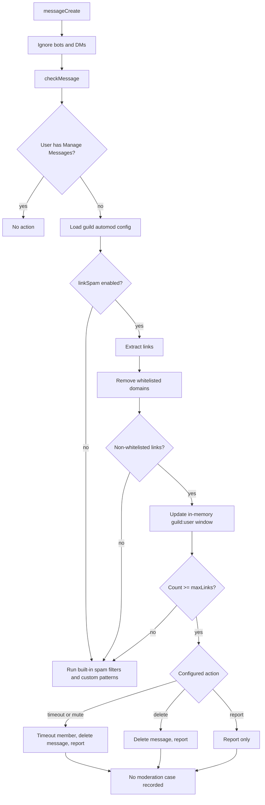
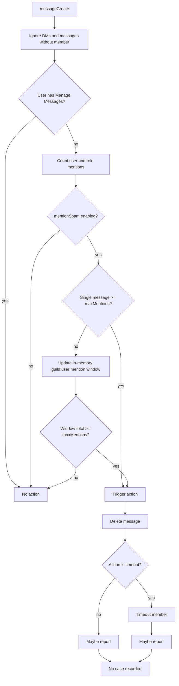
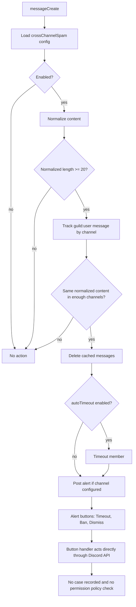
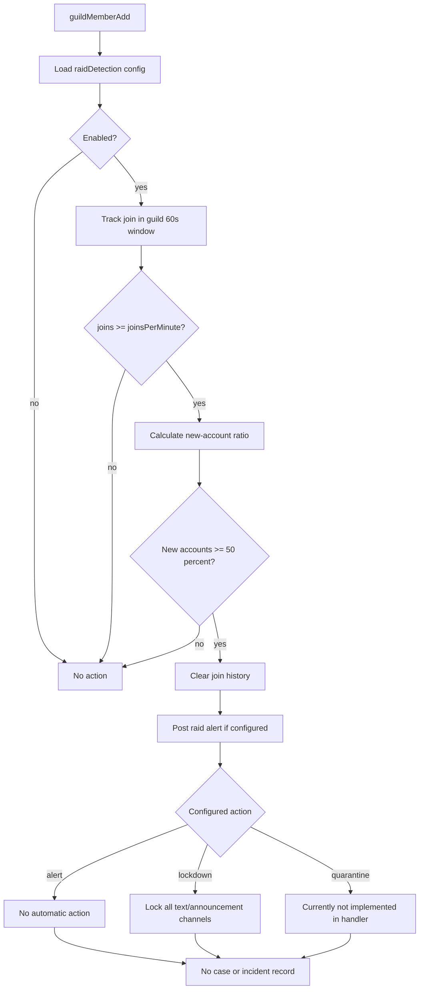
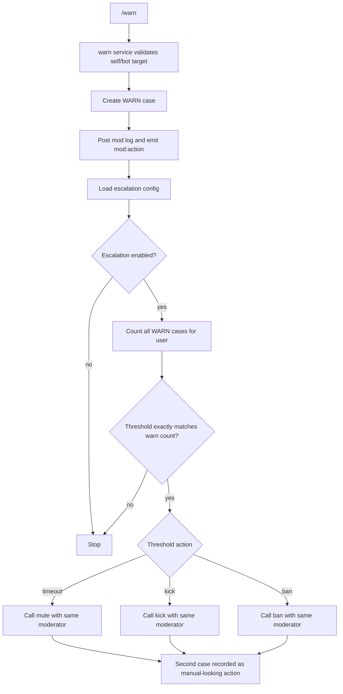
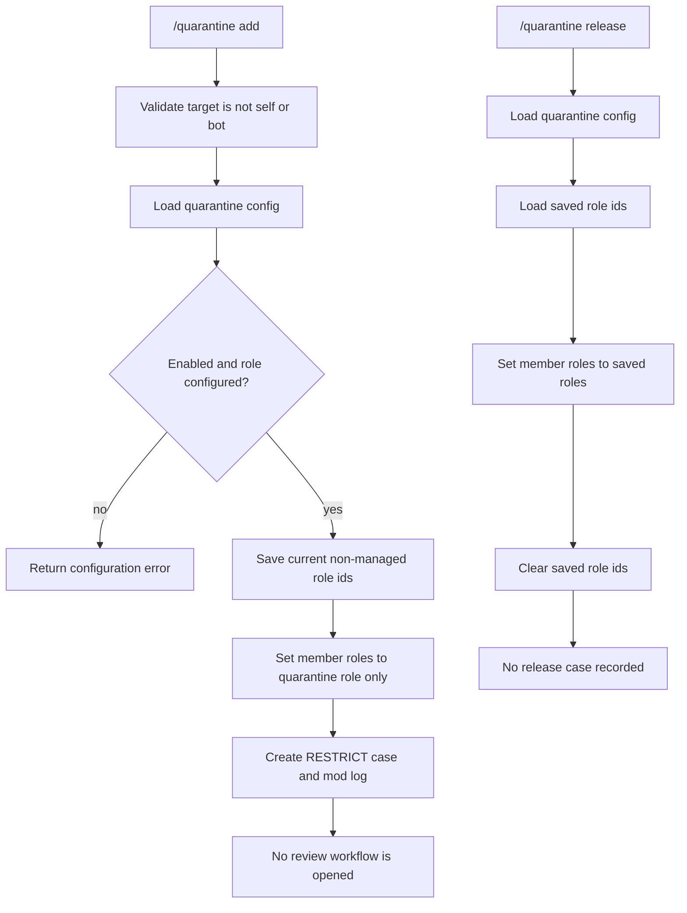
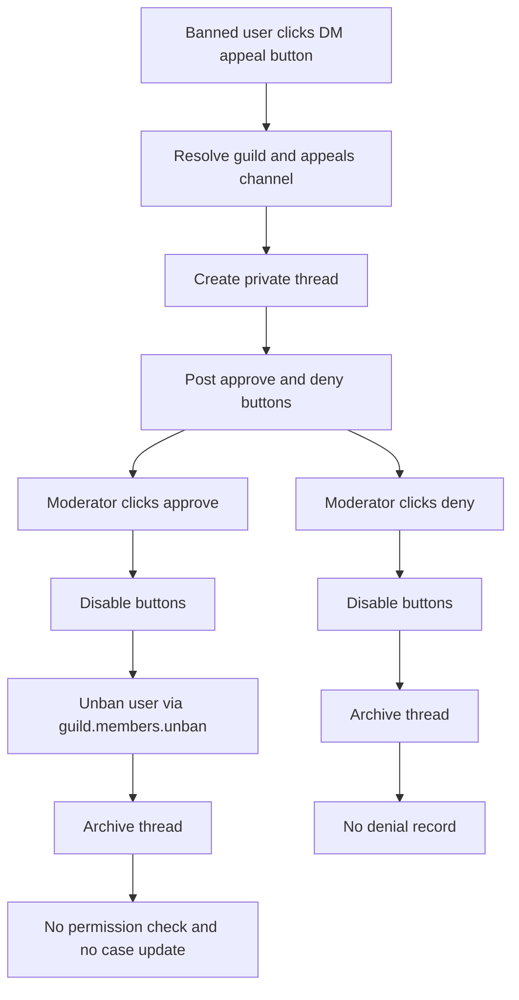
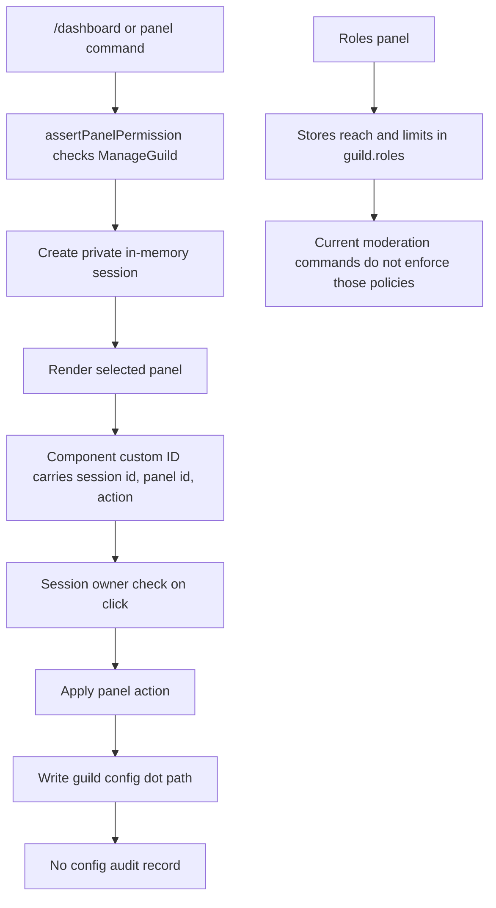

# Moderation Audit And Overhaul

This document is the audit-first implementation pass for moderation. It maps
the current behavior, calls out abuse and reliability gaps, and defines the
next moderation architecture before code changes start. The goal is to make the
system understandable, hard to abuse, and consistent across manual moderation,
automod, appeals, verification, and admin panels.

## Current Scope Map

| Surface | Entrypoint | Current owner | Current permissions | Side effects | Case recorded |
| --- | --- | --- | --- | --- | --- |
| Ban | `/ban` | `src/features/moderation/commands/ban.ts` | Discord `BanMembers` | Bans user, optional temp-ban row, DM appeal button, mod log | Yes |
| Kick | `/kick` | `src/features/moderation/commands/kick.ts` | Discord `KickMembers` | Kicks member, mod log | Yes |
| Timeout | `/mute` | `src/features/moderation/commands/mute.ts` | Discord `ModerateMembers` | Applies Discord timeout, mod log | Yes |
| Warn | `/warn` | `src/features/moderation/commands/warn.ts` | Discord `ModerateMembers` | Records warning, DMs user, can trigger escalation | Yes |
| Quarantine | `/quarantine add` | `src/features/moderation/commands/quarantine.ts` | Discord `ModerateMembers` | Stores current roles, replaces roles with quarantine role | Yes |
| Release | `/quarantine release` | `src/features/moderation/commands/quarantine.ts` | Discord `ModerateMembers` | Restores saved roles | No |
| Purge | `/purge` | `src/features/moderation/commands/purge.ts` | Discord `ManageMessages` | Bulk deletes recent messages | No |
| Lockdown | `/lockdown` | `src/features/moderation/commands/lockdown.ts` | Discord `ManageChannels` | Updates channel permission overwrites | No |
| Case view/edit/delete | `/case` | `src/features/moderation/commands/case.ts` | Discord `ModerateMembers` | Reads, edits, or deletes case records | Edit/delete not audited |
| Case history | `/cases` | `src/features/moderation/commands/cases.ts` | No explicit Discord permission | Shows a user's sanction history | Read only |
| Notes | `/note` | `src/features/moderation/commands/note.ts` | Discord `ModerateMembers` | Adds/lists/deletes private notes | Note record only |
| Mod config | `/modset` | `src/features/moderation/commands/modset.ts` | Discord `ManageGuild` | Writes moderation config | No config audit |
| Automod config | `/automod` | `src/features/automod/commands/automod.ts` | Discord `ManageGuild` | Writes automod config | No config audit |
| Link filters | `messageCreate -> checkMessage` | `src/features/automod/service.ts` | Skips `ManageMessages` users | Delete, timeout, report | No |
| Mention spam | `messageCreate -> checkMentionSpam` | `src/features/automod/mentionSpam.ts` | Skips `ManageMessages` users | Delete, timeout, report | No |
| Cross-channel spam | `messageCreate -> checkCrossChannelSpam` | `src/features/automod/crossChannelSpam.ts` | No explicit staff bypass | Deletes cached messages, optional timeout, alert buttons | No |
| Slowmode | `messageCreate -> checkSlowmode` | `src/features/automod/slowmode.ts` | No explicit staff bypass | Sets channel slowmode, schedules release | No |
| Raid detection | `guildMemberAdd -> registerRaidDetection` | `src/features/automod/raidDetection.ts` | System action | Alerts and optional lockdown | No |
| Verification | `guildMemberAdd -> registerVerification` | `src/features/moderation/verification.ts` | System action | Kicks new accounts or posts verify prompt | No |
| Alt detection | `guildMemberAdd -> registerAltDetection` | `src/features/moderation/altDetection.ts` | Alert only | Posts possible-alt alert | No |
| Appeal submit | `mod:appeal:*` button | `src/features/moderation/handlers/appealButton.ts` | Banned user via DM | Creates private appeal thread | No |
| Appeal approve/deny | `mod:appeal:approve:*`, `mod:appeal:deny:*` | `src/features/moderation/handlers/appealButton.ts` | No explicit runtime permission check | Unbans or archives thread | No |
| Automod alert actions | `automod:spam:*`, `automod:raid:*` buttons | `src/features/automod/handlers` | No explicit runtime permission check | Timeout, ban, dismiss, lockdown | No |
| Admin panels | `panel:*` components | `src/features/adminPanels/panels.ts` | Session owner plus `ManageGuild` at open time | Writes config and role policy | No config audit |
| Temp-ban sweep | `temp-ban-sweep` job | `src/features/moderation/index.ts` | System action | Unbans expired temp bans | Deletes temp row, no case |

## High-Risk Flowcharts

### Link Spam



Audit notes:
- Built-in spam filters and custom patterns still run even when link spam is
  disabled.
- Link spam stores detection state in memory only.
- Timeout/delete/report actions bypass the moderation service and do not create
  case records.

### Mention Spam



Audit notes:
- Detection and enforcement are coupled in one function.
- Report behavior only sends alerts for non-delete actions.
- No case is recorded for delete, timeout, or report-only outcomes.

### Cross-Channel Spam



Audit notes:
- Detection does not skip staff roles by default.
- Alert buttons can perform destructive actions without a local authorization
  check in the handler.
- Button actions bypass the moderation service.

### Raid Detection



Audit notes:
- Schema allows `quarantine`, but the current handler only performs lockdown.
- Alert embeds use a fixed seven-day display for new-account count rather than
  the configured threshold.
- Lockdown is not represented as a moderation incident.

### Warn Escalation



Audit notes:
- Escalation cases do not carry a source that distinguishes policy automation
  from an intentional manual action.
- Threshold matching is exact, so skipped or imported warning counts may not
  trigger the expected highest threshold.
- The same moderator is used as actor for automated follow-up action.

### Quarantine And Release



Audit notes:
- Quarantine can overwrite roles with no role hierarchy preflight.
- Release is not auditable as a case.
- Saved roles are trusted when restored.

### Ban Appeal Approval



Audit notes:
- Approve/deny handlers rely on component reachability, not explicit runtime
  authorization.
- Appeal outcomes are not attached to the original ban case.
- Appeals do not collect structured user-provided appeal text.

### Role Policy And Admin Panels



Audit notes:
- Panel sessions reduce drive-by component abuse, but config writes are not
  audited.
- Role policy exists as admin data and performance display, not as command
  authorization.
- `src/features/adminPanels/panels.ts` owns rendering, routing, modal parsing,
  and persistence in one large module, making moderation UX risky to extend.

## Abuse Model

| Abuse vector | Current exposure | Required control |
| --- | --- | --- |
| Moderator uses a command above their intended guild role policy | Discord permissions are checked, but `guild.roles.*.reach` and limits are not enforced | Add `authorizeModerationAction` middleware/service gate for every manual and component action |
| Moderator spams purge, timeout, ban, or case deletion | No local rate limit for moderation actions | Enforce per-action limits from `guild.roles.*.limits` and record denials |
| Staff member clicks automod alert button without authority | Spam and raid button handlers do not perform explicit permission checks | Require authorization inside every button handler before disabling buttons or acting |
| Appeal approve is clicked by an unauthorized user with component access | Appeal approve/deny handlers do not check `BanMembers`, policy, or staff role | Require appeal decision authorization and record decision actor |
| Moderator edits or deletes cases to hide action history | `/case edit/delete` changes records without append-only audit | Make case edits append revisions; make deletes soft deletes with actor and reason |
| Bot attempts impossible action due to role hierarchy | Service mostly trusts Discord API failure | Preflight target hierarchy, bot hierarchy, and required bot permissions with clear user-facing errors |
| Automod punishes staff or trusted roles | Some detectors skip `ManageMessages`; others do not | Centralize bypass policy for staff, protected roles, bots, and configured channels |
| System actions are invisible | Automod, verification kicks, temp-ban expiry, slowmode, lockdown, and release are mostly untracked | Record system incidents with source, actor type, evidence, and result |
| Configuration changes are unaudited | `/modset`, `/automod`, and panels write direct config paths | Add config audit records with old value, new value, actor, source surface, and timestamp |

## Unified Moderation Action Contract

All manual commands, automod actions, appeal outcomes, escalation actions, and
system jobs should flow through a shared contract. The concrete implementation
can live in `src/features/moderation/actionPipeline.ts` or a similarly focused
module.

```ts
type ModerationSource = "manual" | "automod" | "appeal" | "escalation" | "system";
type ModerationActorType = "user" | "bot" | "system";
type ModerationAction =
  | "WARN"
  | "TIMEOUT"
  | "KICK"
  | "BAN"
  | "UNBAN"
  | "RESTRICT"
  | "RELEASE"
  | "PURGE"
  | "LOCKDOWN"
  | "SLOWMODE"
  | "VERIFY_KICK"
  | "CONFIG_CHANGE"
  | "CASE_EDIT"
  | "CASE_DELETE";

interface ModerationActionRequest {
  guildId: string;
  source: ModerationSource;
  action: ModerationAction;
  actor: {
    type: ModerationActorType;
    userId?: string;
    roleIds?: string[];
  };
  target: {
    userId?: string;
    channelId?: string;
    messageIds?: string[];
  };
  reason: string;
  evidence?: {
    summary: string;
    messageContent?: string;
    matchedRule?: string;
    configPath?: string;
  };
  requestedAt: string;
}

interface ModerationActionResult {
  ok: boolean;
  caseId?: number;
  incidentId?: string;
  discordActionId?: string;
  errorCode?: string;
  errorMessage?: string;
}
```

Required service responsibilities:
- `authorizeModerationAction(request)` checks Discord permissions, configured
  role policy, action limits, protected targets, staff bypass, and bot hierarchy.
- `executeModerationAction(request)` performs the Discord side effect only after
  authorization succeeds.
- `recordModerationAction(request, result)` writes append-only cases/incidents
  for successful actions and important denials/failures.
- Existing `ban`, `kick`, `mute`, `warn`, `quarantine`, and `release` should
  become thin wrappers over this pipeline rather than separate policy islands.

## Discord UX Design

The Discord UI should be the fast-action surface, not a giant settings manual.
Every moderation embed should answer: what happened, who acted, why, what
evidence exists, and what the next safe action is.

Recommended Discord surfaces:
- Add `/mod help` with sections for first setup, daily moderation, automod, case
  review, appeals, and emergency actions.
- Keep `/automod status`, but render risk summaries and missing setup steps:
  report channel missing, quarantine role missing, escalation disabled, cases
  not recording for automod, and high-risk actions without confirmation.
- Add confirmation buttons for destructive actions: ban, case delete, lockdown,
  mass purge, quarantine role replacement, and appeal approve.
- Make case detail embeds richer: source, actor, action result, evidence, prior
  cases, linked appeal/reversal, and revision history.
- Paginate `/cases` and restrict it to moderators by default. If public lookup
  is wanted later, expose a separate self-history view.
- Keep admin panels compact: status fields, one selected section, obvious next
  action, and no raw JSON. The current automod panel is the right direction,
  but it needs validation, audit, and safer labels.

## Web Dashboard Recommendation

Build the bot-side audit/action model first. Do not start the web dashboard
until cases, incidents, config audit, authorization, and automod recording are
consistent.

Recommendation after that foundation: yes, a web dashboard is worth it.

Discord should own:
- Fast incident response.
- Alert review.
- Simple case lookup.
- Emergency actions.
- Lightweight setup checks.

The web dashboard should own:
- Detailed policy configuration.
- Case timelines and evidence review.
- Appeal queue and decision history.
- Moderator performance and abuse auditing.
- Automod rule simulation and false-positive review.
- Config diff history and rollback.

The dashboard should not be a second moderation engine. It should call the same
moderation action contract used by Discord commands and components.

## Prioritized Repair Backlog

1. Create the shared moderation action pipeline with authorization, execution,
   and recording boundaries.
2. Convert manual actions to the pipeline while preserving current slash command
   names and user-facing behavior.
3. Add runtime authorization to all moderation component handlers before they
   disable buttons or perform actions.
4. Make role policy enforceable for commands and components, including limits.
5. Record automod actions, verification kicks, temp-ban expiry, release,
   lockdown, purge, appeal decisions, case edits, and config changes.
6. Add protected-target and bot-permission preflight checks with clear errors.
7. Fix raid `quarantine` behavior or remove it from the schema/UI until it
   exists.
8. Add `/mod help` and improve `/automod status` into setup-oriented embeds.
9. Split `src/features/adminPanels/panels.ts` by panel domain before adding more
   moderation UX.
10. Revisit web dashboard implementation after the case/action model is stable.

## Test And Verification Plan

Static audit checklist:
- Every command, component, event, and job has an owner, permission model,
  config dependencies, side effects, logging, case/audit behavior, and failure
  path documented.

Authorization tests:
- Users without configured policy cannot run destructive commands.
- Users without configured policy cannot click spam, raid, or appeal action
  buttons.
- Action limits deny excessive use and record the denial.
- Staff/protected targets cannot be moderated by lower-trust actors.

Case recording tests:
- Manual warn, timeout, kick, ban, quarantine, and release produce consistent
  case shapes.
- Automod delete, timeout, report, cross-channel timeout, raid lockdown, and
  verification kick create incident/case records with source and evidence.
- Appeal approval links an unban outcome to the original ban case.
- Case edit/delete creates revision records rather than silent mutation.

Handler tests:
- Link spam threshold, whitelist bypass, report-only, delete, and timeout.
- Mention spam single-message and windowed thresholds.
- Cross-channel spam cached message deletion and button authorization.
- Raid alert, lockdown, and quarantine behavior.
- Admin panel config writes include audit records and validation failures.

UI tests:
- `/mod help` renders setup and daily-use sections.
- `/automod status` surfaces missing setup and enabled protections.
- Case detail embeds show source, actor, target, evidence, and result.
- Confirmation buttons expire and cannot be used by another moderator.

Current verification limitation:
- `bun` was not available in this shell during audit planning, so repository
  test and typecheck commands could not be executed here.
